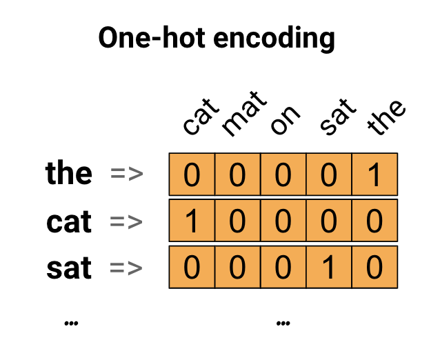
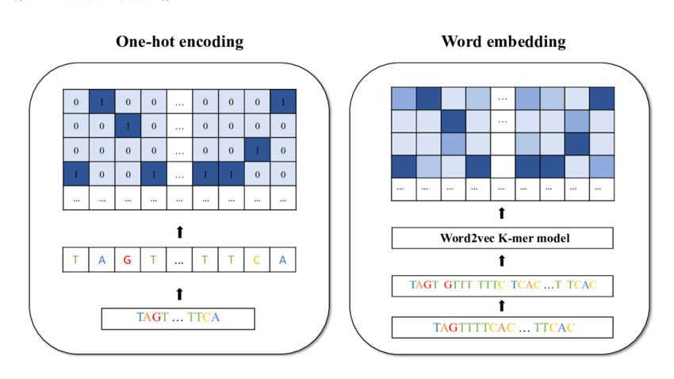
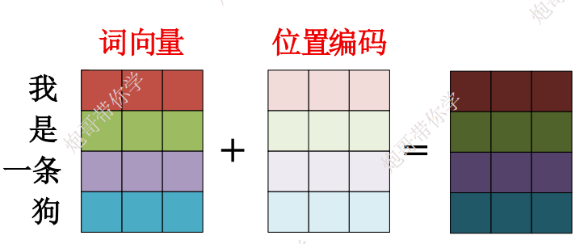
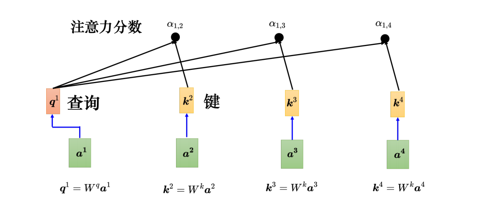
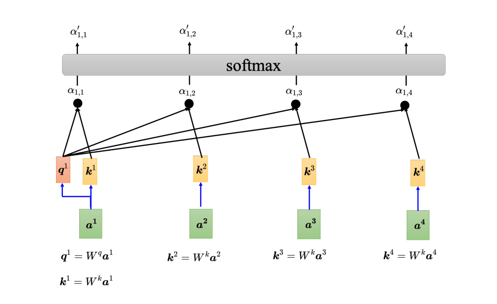
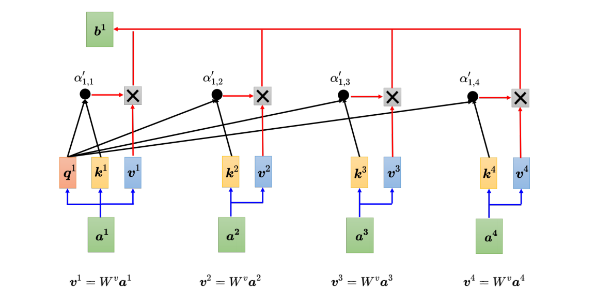

# Transformer

Transformer是一个基于自注意力机制的序列模型，由Google的研究团队提出；论文发表于2017年。主要致力于在序列建模中提升并行性与长距离依赖建模能力，摆脱对循环与卷积的依赖。

## 架构


## 输入数据

Transformer都是数值运算，意味着文本输入进来需要转成数值，
出去后需要从数值转成文本。会经过如下的过程： 
1. 分词（Tokenization）
2. 转换成ToeknID
3. 词嵌入+位置编码

### 独热编码


假设词汇表大小 = 10万个词（现代大模型常见规模）。

- “猫” 的独热向量可能是：[0,0,0,...,1,...,0]（第 34217 位是1，其余全是0）
- “狗” 是：[0,0,0,...,1,...,0]（第 5789 位是1，其余0）

### 词嵌入
词嵌入把人类语言中离散的“词”变成了计算机能高效计算的连续**稠密向量**，并且这个向量还携带了丰富的语义、语法、上下文关系信息。



每一个token都映射成一个向量，组合成一张大的词表。
（可以理解词表中的每一行向量代表一个token）

词表大小：[vocab_size, d_model] \
vocab_size 表示词的数量 \
d_model 表示矩阵的维度

示例：
```
词汇表：   [PAD, hello, world, !, <EOS>]
Token ID：     0      1       2     3      4

嵌入矩阵 W（简化示意）：

W = [
  [ 0.00,  0.00,  0.00,  0.00],   ← token 0 (PAD)
  [ 0.12, -0.45,  0.31,  0.18],   ← token 1 (hello)
  [-0.25,  0.67, -0.09,  0.44],   ← token 2 (world)
  [ 0.88,  0.03, -0.72,  0.15],   ← token 3 (!)
  [ 0.01, -0.11,  0.55, -0.33]    ← token 4 (<EOS>)
]
```

### 位置编码
Transformer 的自注意力机制本身是完全不感知顺序的（permutation invariant），如果不额外注入位置信息，模型就无法区分“我爱你”和“你爱我”这种顺序完全相反但语义截然不同的句子。位置编码就是**给每个位置赋予一个独特的、可学习的/可计算的“身份”**，让模型能感知相对位置和绝对位置。



#### 计算方式

1. **Sinusoidal Positional Encoding 正弦位置编码** \
    公式（Attention is All You Need 论文）：
    对于位置 pos（从 0 开始），维度索引 i（0 到 d_model/2-1）：

    $PE_{(pos, 2i)}   = \sin\left( pos / 10000^{2i / d_{model}} \right)$ \
    $PE_{(pos, 2i+1)} = \cos\left( pos / 10000^{2i / d_{model}} \right)$

    最终 PE 向量形状：[max_seq_len, d_model]

2. **Rotary Position Embedding 旋转位置嵌入** \
    对 Query 和 Key 向量做旋转变换

    $\begin{bmatrix}
x'_{m, 2i}   \\
x'_{m, 2i+1}
\end{bmatrix}
= \begin{bmatrix}
\cos(m\theta_i)  & -\sin(m\theta_i) \\
\sin(m\theta_i)  & \cos(m\theta_i)
\end{bmatrix}
\begin{bmatrix}
x_{m, 2i}   \\
x_{m, 2i+1}
\end{bmatrix}$ \
RoPE是在attention中计算q、k的时候才做计算。
    ```python
    # 在 attention 模块里（伪代码）
    def attention_layer(x):
        # [bs, seq, heads, head_dim]
        q = linear_q(x)
        k = linear_k(x)
        v = linear_v(x)
        
        # RoPE
        q = apply_rotary_emb(q, freqs_cis)
        k = apply_rotary_emb(k, freqs_cis)
        
        # 自注意力
        scores = torch.matmul(q, k.transpose(-2, -1)) / math.sqrt(head_dim)
        ...
    ```

## 自注意力机制

注意力机制最初用于序列到序列（Seq2Seq）模型中，帮助解码器关注编码器的不同部分。自注意力是其特殊形式，其中查询（Query）、键（Key）和值（Value）都来自同一输入序列。这使得模型能够“自我关注”，即序列中的每个元素都能看到整个序列的其他元素。



计算各个向量的注意力分数


以a1为例：
计算a1和a2：
$$ q^1 = W^qa^1 $$
$$ k^2 = W^ka^2 $$
$$ a' = q^1k^2$$
同理得到：
$$ q^1k^3...q^1k^4$$

接下来会对结果进行softmax归一化（合为1） \
\
$\alpha_i = \frac{\exp(s_i)}{\sum_j \exp(s_j)} \quad \Rightarrow \quad \sum_i \alpha_i = 1, \quad \alpha_i \in [0,1]$ \
\
为什么使用softmax：
1. 对分数高的 key 指数级放大
2. 对分数低的 key 指数级压制（接近0）


接下来根据 α′ 去抽取出序列里面重要的信息。把向量 a1 到 a4 乘上 Wv 得到新的向量：v1、v2、v3 和 v4，接下来把每一个向量都去
乘上注意力的分数 α′，再把它们加起来。如果a1和a2关联性很强，在做加权后，得到的b1会比较接近v2，所以谁的注意力分数最大，谁的v就会主导结果。



### 从矩阵的角度理解
